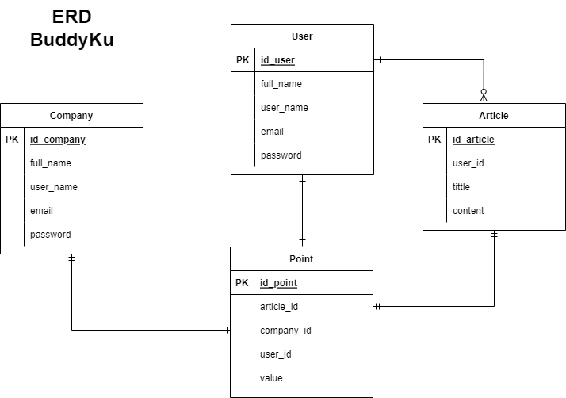

# BuddyKu

<!-- PROJECT LOGO -->
 

  <h3 align="center">Project-Test "BuddyKu" </h3>

  

    Project Test Pembangunan RESTful API BuddyKu
     
    <a href="https://github.com/test-mnc/Task2-buddyku"><strong>Silahkan Kunjungi »</strong></a>
     
  

<!-- ABOUT THE PROJECT -->
### 💻 &nbsp;About The Project

BuddyKu merupakan aplikasi untuk para konten kreator dan publiser bisa berkreasi dan berkarya. Project RESTful API BuddyKu dibangun dengan menggunakan bahasa Golang.    
Dilengkapi dengan berbagai fitur yang memungkinkan user bisa mengakses data, mulai dari membuat akun, mempublish artikel, dan mendapatkan point dari artikelnya. Di sisi lain juga terdapat fitur yang mana company(employee) bisa memberikan point kepada user yang telah mempublish artikelnya. Agar user bisa mendapatkan point ketika mempublish artikel, maka harus ada employee yang register terlebih dahulu.
Adapun fitur yang ada dalam RESTful API kami antara lain :

      

🙎 User

  
  <!---
  | Command | Description |
| --- | --- |
  --->
  
 User dapat membuat akun dan login, agar mendapat legalitas untuk mengakses berbagai fitur lain di aplikasi ini. 
 Terdapat juga fitur lihat profile yang mana user bisa melihat detail profilenya.
 

  
| Feature User | Endpoint | Param | JWT Token | Fungsi |
| --- | --- | --- | --- | --- |
| POST | /users  | - | NO | Melakukan proses registrasi user |
| POST | /login | - | NO | Melakukan proses login user |
| GET | /users | - | YES | Mendapatkan informasi akun user yang sedang login |

📄 &nbsp;Article

  
  <!---
  | Command | Description |
| --- | --- |
  --->
Article merupakan fitur dimana user dapat mempublish artikel yang telah dibuatnya agar user yang lain bisa membaca dan mendapatkan informasi dari artikel tersebut.

| Feature Article | Endpoint | Param | JWT Token | Fungsi |
| --- | --- | --- | --- | --- |
| POST | /articles | - | YES | Mempublish artikel yang telah dibuat dan mendapatkan reward(point) |
| GET | /articles | - | NO | Menampilkan daftar artikel yang ada di platform ini |
| GET | /articles/:idArticle | idArticle | NO | Menampilkan satu artikel berdasarkan id Artikelnya  |

🏢 &nbsp;Company

  
  <!---
  | Command | Description |
| --- | --- |
  --->
Company merupakan fitur dimana employee dapat memanage user diantaranya melihat daftar user yang telah registrasi dan memberikan reward(point) kepada user yang telah mempublish artikel. Pada fitur ini employee harus registrasi terlebih dahulu dan login agar bisa mengakses fitur yang lain.

| Feature Negotiation | Endpoint | Param | JWT Token | Fungsi |
| --- | --- | --- | --- | --- |
| POST | /company | - | NO | Registari untuk employee |
| POST | /company/login | - | NO | Login untuk employee, setelah registrasi |
| GET | /company/users | - | YES | Menampilkan daftar user yang telah registrasi di platform ini |
| POST | /company/points | - | YES | Memberikan reward berupa nilai / poin kepada user berdasarkan artikelnya |

💎 &nbsp;Point

  
  <!---
  | Command | Description |
| --- | --- |
  --->
Point merupakan fitur dimana user dan employee bisa melihat point yang diperoleh user berdasarkan artikelnya.

| Feature Contractor | Endpoint | Param | JWT Token | Fungsi |
| --- | --- | --- | --- | --- |
| GET | /points/:idArticle | idArticle | YES | Menampilkan point per 1 artikel|
| GET | /points/users/:idUser| idUser | YES | Menampilkan total point yang didapatkan oleh masing-masing user |

### Swagger
<a href="https://app.swaggerhub.com/apis-docs/faizalsundara/Test-BuddyKu/1.0.0" target=”_blank”><strong> Link »</strong></a>

<!-- IMAGES -->
### 🖼&nbsp;Images

📈&nbsp;ERD

<!-- CONTACT -->
### Contact

:copyright: 2022 | Faizal

</h3>
